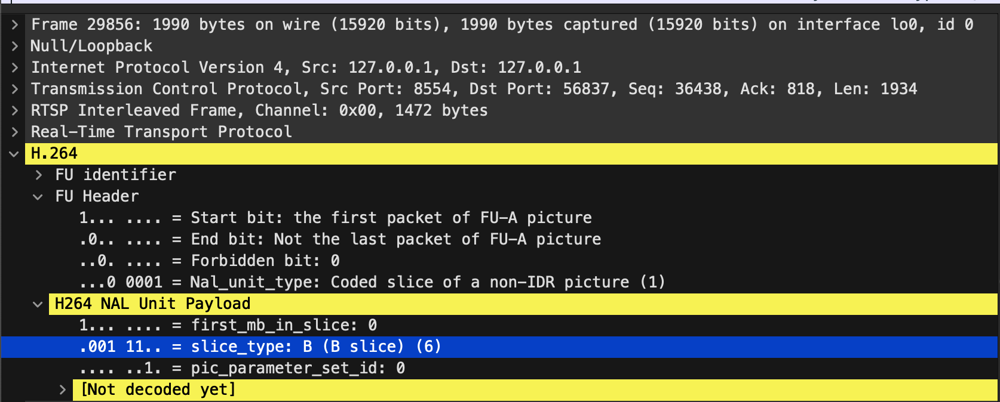

# Packet Juggling Exploration

https://en.wikipedia.org/wiki/Real-time_Transport_Protocol

## Implementation ideas
### RTSP streaming
RTSP needs an RTSP server. ffmpeg can't create a stream on its own, it can just push to an RTSP server.

We can start an RTSP server in a docker container with `docker-compose -f rtsp-server.docker-compose.yaml up`.

ffpmeg can stream with a command like this: `ffmpeg -re -stream_loop -1 -i {input_file} -vcodec libx264 -f rtsp -muxdelay 0.1 {output_url}`.

When we looked at traffic with Wireshark we could only inspect the client side traffic, not the 'to server pushing' traffic. We'll monitor this traffic.

### Mininet
Because the RTSP server runs outside of mininet, we need to access it somehow. We've tried setting up NAT, but it didn't really work.

Because we monitor client side traffic, the consuming client will be inside of the network. (The ffmpeg pushing to the server can be inside mininet as well, but not required).

Question:
- How can we access the RTSP server from outside of mininet?

### Unique stream IDs
The unique stream identifier is the destination port of the TCP packet.
```sh
tshark -r rtsp_h264_2.pcapng -T fields -e tcp.dstport -Y "rtsp" | sort | uniq
56824
56837
56841
56844
8554
```

```sh
tshark -r rtsp_h264_1.pcapng -T fields -e tcp.dstport -Y "rtsp" | sort | uniq
55971
8554
```

### P4 implementation ideas
In P4 we'll create a register and use it as a map to store counters.
There will be three registers, for P, B, and I frames separately

We'll parse this field from the header: 

If we could parse that field, we'll increment the appropriate counter. If not, we do nothing.

Questions:
- How can the counters be read?
